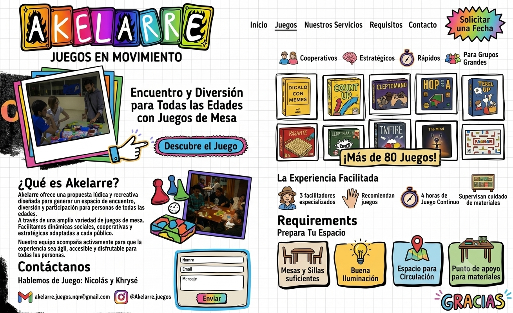

# Documento de Requisitos del Producto (PRD) — Akelarre: Juegos en Movimiento

| Campo | Detalle |
| --- | --- |
| **Producto** | Sitio web institucional y comercial de Akelarre |
| **Versión** | 1.0 |
| **Fecha** | 20 de julio de 2026 |
| **Estado** | Borrador aprobado para implementación |
| **Stack objetivo** | MERN (MongoDB, Express, React, Node.js) + Tailwind CSS |
| **Mockup de referencia** | [`mockup.png`](./mockup.png) |



---

## 1. Product Manager — Estructura y Definición

### 1.1 Objetivo

Desarrollar una web **escalable, responsiva, visual y accesible** que centralice la oferta lúdica de **Akelarre: Juegos en Movimiento**, permitiendo a visitantes:

- Conocer la propuesta, el equipo y los servicios.
- Explorar la ludoteca (+80 juegos) con filtros útiles.
- Solicitar una fecha / contratación de forma clara.
- Contactar por email y redes sociales.

### 1.2 Propuesta de valor

> Creemos que jugar no es solo para la infancia. El juego es una práctica social y afectiva.

Akelarre transforma cualquier espacio en una experiencia de juego facilitada, con materiales, recomendación de juegos y acompañamiento especializado.

### 1.3 Audiencia

| Segmento | Necesidad principal |
| --- | --- |
| Familias y grupos de amigos | Contratar una noche de juegos o evento |
| Instituciones / escuelas / centros culturales | Instalar o contratar ludoteca y facilitación |
| Organizadores de eventos | Conocer requisitos, duración y catálogo |
| Comunidad de jugadores | Descubrir juegos y seguir la actividad en redes |

### 1.4 Páginas y secciones

#### Inicio (Hero)

- **Video Hero** de bienvenida (fondo a pantalla completa).
- **Título:** «Transformamos cualquier espacio en una experiencia de juego».
- CTA primario alineado al mockup: **«Solicitar una Fecha»** / **«Contratar»**.
- CTA secundario (mockup): **«Descubre el Juego»** (scroll o ancla a Ludoteca / Qué es Akelarre).
- Elemento visual de apoyo (mockup): marco estilo Polaroid con foto de personas jugando.
- Headline de apoyo del mockup: «Encuentro y Diversión para Todas las Edades con Juegos de Mesa».

#### Qué es Akelarre / Quiénes Somos

- Texto de filosofía (práctica social y afectiva del juego).
- Presentación de **Nicolás y Khrysé** («Hablemos de Juego»).
- Mención de los **3 facilitadores especializados**.
- Ilustraciones de apoyo: meeples, caja de juego, estética “sticker” del mockup.

#### Servicios

Tarjetas descriptivas (en móvil: carrusel; en desktop: grilla de 3 columnas):

1. **Noches de Juegos**
2. **Eventos**
3. **Instalaciones Lúdicas**

#### Dinámica y Requisitos

Sección informativa «La Experiencia Facilitada» + «Prepara Tu Espacio»:

| Experiencia | Requisitos del espacio |
| --- | --- |
| 3 facilitadores especializados | Mesas y sillas suficientes |
| Recomiendan juegos | Buena iluminación |
| 4 horas de juego continuo | Espacio para circulación |
| Supervisan cuidado de materiales | Punto de apoyo para materiales |

#### Ludoteca

- Catálogo digital interactivo con **más de 80 juegos**.
- Filtros: **edad**, **duración**, **cantidad de jugadores**, **tipo**.
- Categorías visuales del mockup: Cooperativos, Estratégicos, Rápidos, Para grupos grandes.
- Tarjetas de juego con portada/ilustración e íconos (jugadores, tiempo).
- Badge: **«¡Más de 80 Juegos!»**.
- Función de gamificación: botón **«¡Sorpréndeme!»** (ver §5).

#### Galería y Clientes

- Grilla de fotos/videos de experiencias.
- Logos de instituciones / clientes.
- Aviso de derechos de imagen (ver §4).

#### Contrataciones / Contacto

Formulario con campos:

| Campo | Tipo | Obligatorio |
| --- | --- | --- |
| Nombre | texto | sí |
| Teléfono | tel | sí |
| Tipo de evento | select | sí |
| Cantidad de asistentes | número | sí |
| Fecha | date | sí |
| Email / Mensaje | opcionales según diseño | recomendado |

- CTA del header: **«Solicitar una Fecha»**.
- En el mockup aparece además un formulario compacto (Nombre, Email, Mensaje) con botón **«Enviar»**; el MVP de contrataciones prioriza el formulario completo de la tabla anterior.
- Aviso de Privacidad debajo del formulario (ver §4).

#### Redes Sociales y contacto directo

- Priorizar **comunidad** (≈ 3 posts/semana) sobre **promoción** (≈ 2 posts/semana) en la integración/feed.
- **Email:** `akelarre.juegos.nqn@gmail.com`
- **Instagram:** `@Akelarre.juegos`

### 1.5 Navegación (IA)

| Ítem | Destino |
| --- | --- |
| Inicio | Hero |
| Juegos | Ludoteca |
| Nuestros Servicios | Servicios |
| Requisitos | Dinámica y Requisitos |
| Contacto | Contrataciones / Formulario |
| Solicitar una Fecha | CTA → Formulario |

### 1.6 Criterios de éxito (MVP)

- Sitio usable en mobile y desktop sin roturas de layout.
- Ludoteca filtrable consumiendo API real (`GET /api/juegos`).
- Formulario de contratación enviando datos a `POST /api/contacto`.
- Cumplimiento mínimo legal: aviso de privacidad + derechos de imagen.
- Accesibilidad básica: contraste legible, foco visible, labels en formularios, texto alternativo en imágenes.

### 1.7 Fuera de alcance (MVP)

- E-commerce / pasarela de pagos.
- App nativa o PWA de bares con QR.
- Panel admin completo (puede usarse seed/scripts para cargar juegos).
- Autenticación de usuarios finales.

---

## 2. Diseñador UX/UI — Esquema (Mockup Responsive)

### 2.1 Estilo visual

- Estética **lúdica, vibrante y “hand-drawn”**: bordes irregulares negros, aspecto de ficha/sticker.
- Fondo tipo **hoja cuadriculada** (cuaderno) como textura de marca.
- **Paleta** extraída del logo / mockup:

| Token sugerido | Uso | Color de referencia |
| --- | --- | --- |
| `--ak-orange` | Acentos, cards | Naranja |
| `--ak-fuchsia` | CTAs, highlights | Fucsia |
| `--ak-purple` | Gradientes, bordes | Púrpura |
| `--ak-blue` | Botones secundarios | Azul |
| `--ak-cyan` | Acciones suaves (Enviar) | Celeste / teal |
| `--ak-green` | Cards de requisitos | Verde |
| `--ak-ink` | Contornos y texto | Negro |
| `--ak-paper` | Fondo | Blanco cuadriculado |

### 2.2 Tipografía

| Uso | Fuente | Peso |
| --- | --- | --- |
| Títulos, botones, etiquetas | **Fredoka** | Bold |
| Cuerpo, formularios | **Nunito** | Semibold / Bold |

Origen: Google Fonts.

### 2.3 Layout móvil (wireframe)

1. **Header:** logo centrado + menú hamburguesa.
2. **Hero:** video de fondo con **opacidad ~60%**, frase potente centrada, botón **«Contratar»**.
3. **Servicios:** carrusel horizontal (swipe).
4. **Ludoteca:** buscador + etiquetas/filtros desplegables; tarjetas con íconos de jugadores y tiempo.
5. **Footer:** redes, email y enlaces legales.

### 2.4 Layout desktop

- Menú hamburguesa → **barra de navegación superior** (Inicio, Juegos, Nuestros Servicios, Requisitos, Contacto) + CTA starburst **«Solicitar una Fecha»**.
- Composición tipo **dos columnas** (como en el mockup): narrativa / contacto a la izquierda; ludoteca + experiencia + requisitos a la derecha (o secciones apiladas equivalentes).
- Tarjetas de servicios: **grilla de 3 columnas** (en lugar del carrusel).
- Ludoteca: grilla de juegos (p. ej. 2–5 columnas según breakpoint, acorde al mockup).

### 2.5 Componentes UI clave (del mockup)

- Logo «AKELARRE» en letras bloque coloridas con motivo de llamas + tagline «JUEGOS EN MOVIMIENTO».
- Botones con borde grueso, tipografía Fredoka, hover “ficha” (flotación + color vibrante).
- CTA header en forma de **starburst** / estrella irregular.
- Cards de requisitos con color de fondo distinto por ítem.
- Badge tipo bocadillo: «¡Más de 80 Juegos!».
- Formulario con borde dibujado a mano.
- Cierre visual «GRACIAS» con tipografía decorativa.

### 2.6 Accesibilidad UX

- Contraste AA mínimo en texto sobre fondos de color.
- Controles de filtro usables con teclado.
- Texto del video Hero no dependiente solo del audio (frase visible).
- Preferencia `prefers-reduced-motion` para desactivar microinteracciones intensas.

---

## 3. Desarrollador Full-Stack MERN — Implementación (Paso a Paso)

### Paso 1 — Backend base

- Inicializar proyecto Node.js.
- Configurar **Express** (CORS, JSON body parser, variables de entorno).
- Estructura sugerida: `server/src/{routes,models,controllers,config}`.

### Paso 2 — Modelo de datos (MongoDB)

Colecciones mínimas:

#### `Juegos`

```json
{
  "nombre": "String",
  "descripcion": "String",
  "imagenUrl": "String",
  "edadMinima": "Number",
  "duracionMinutos": "Number",
  "jugadoresMin": "Number",
  "jugadoresMax": "Number",
  "tipos": ["cooperativo", "estrategico", "rapido", "grupos_grandes"],
  "activo": true
}
```

#### `Servicios`

```json
{
  "nombre": "String",
  "slug": "noches-de-juegos | eventos | instalaciones-ludicas",
  "descripcion": "String",
  "imagenUrl": "String",
  "orden": "Number"
}
```

#### `Contactos`

```json
{
  "nombre": "String",
  "telefono": "String",
  "tipoEvento": "String",
  "cantidadAsistentes": "Number",
  "fecha": "Date",
  "email": "String?",
  "mensaje": "String?",
  "creadoEn": "Date"
}
```

### Paso 3 — API REST

| Método | Endpoint | Descripción |
| --- | --- | --- |
| `GET` | `/api/juegos` | Catálogo; query params: `edad`, `duracion`, `jugadores`, `tipo`, `q` |
| `GET` | `/api/juegos/random?jugadores=` | Juego al azar (Sorpréndeme) — opcional en backend |
| `GET` | `/api/servicios` | Listado de servicios |
| `POST` | `/api/contacto` | Alta de solicitud de contratación |

Respuestas: JSON; códigos `200` / `201` / `400` / `500`. Validación server-side en `POST /api/contacto`.

### Paso 4 — Frontend React + Tailwind

- Scaffold con Vite + React.
- Tailwind CSS para responsive y tokens de marca.
- Routing (React Router) por secciones o scroll-spy en landing + ruta Ludoteca si se separa.

### Paso 5 — Componentes globales

- `Navbar` (mobile hamburger / desktop links + CTA).
- `Footer` (redes, email, legales).
- `Layout` (envoltorio de páginas).

### Paso 6 — Tipografías globales

En CSS global (`index.css`):

```css
@import url('https://fonts.googleapis.com/css2?family=Fredoka:wght@400;500;600;700&family=Nunito:wght@400;600;700&display=swap');
```

Mapear `font-display` → Fredoka y `font-body` → Nunito en Tailwind.

### Paso 7 — Vista Ludoteca

- Consumir `GET /api/juegos`.
- Filtros con **estado local en React** (edad, duración, jugadores, tipo).
- Render de tarjetas con íconos de jugadores/tiempo.
- Estados vacíos y de carga.

### Paso 8 — Formulario de contacto

- Campos del §1.4.
- Validación en cliente (requeridos, teléfono, fecha futura o válida).
- Envío a `POST /api/contacto`.
- Feedback de éxito/error.
- Bloque de **Aviso de Privacidad** debajo del formulario.

### Paso 9 — Despliegue

| Capa | Opciones sugeridas |
| --- | --- |
| Backend + MongoDB | Render / Railway (+ MongoDB Atlas) |
| Frontend | Vercel / Netlify / Render static |
| Variables | `MONGODB_URI`, `CLIENT_URL`, `PORT` |

Checklist post-deploy: CORS, HTTPS, variables de entorno, seed de juegos, prueba de formulario.

---

## 4. Abogado Tecnológico — Requisitos Legales

### 4.1 Aviso de Privacidad (obligatorio bajo el formulario)

Cláusula visible debajo del formulario de contrataciones que explique:

- Qué datos se recogen (**Nombre**, **Teléfono**, y demás campos del formulario).
- Finalidad: gestionar la solicitud de fecha / contratación y responder al interesado.
- Base / consentimiento: el envío del formulario implica aceptación del tratamiento.
- Conservación: solo el tiempo necesario para la gestión comercial.
- Derechos del titular (acceso, rectificación, actualización, supresión) según normativa aplicable (p. ej. Ley 25.326 en Argentina).
- Canal de contacto para ejercer derechos: `akelarre.juegos.nqn@gmail.com`.

### 4.2 Derechos de imagen (Galería)

Aviso legal en la sección Galería / pie legal indicando que:

- Las fotografías y videos publicados corresponden a experiencias reales.
- Se cuenta (o se requerirá) con el **consentimiento** de las personas identificables (o de tutores en caso de menores).
- Quien no desee figurar puede solicitar la baja del material al mismo email de contacto.

### 4.3 Enlaces legales en Footer

- Aviso de Privacidad (página o modal).
- Derechos de imagen / uso de materiales audiovisuales.
- (Opcional MVP+) Términos de contratación de servicios.

---

## 5. Experto en Gamificación — Interacción

### 5.1 Descubrimiento: «¡Sorpréndeme!»

- Botón visible en Ludoteca.
- Flujo:
  1. Usuario indica **cantidad de jugadores** (input o filtro activo).
  2. Al pulsar **«¡Sorpréndeme!»**, se selecciona un juego al azar compatible con ese rango (`jugadoresMin`–`jugadoresMax`).
  3. Se destaca la tarjeta (scroll + highlight) o se abre un modal con el juego.
- Si no hay candidatos: mensaje amigable sugiriendo ajustar jugadores o filtros.

### 5.2 Microinteracciones

- **Hover** en botones y tarjetas de juegos:
  - Flotación ligera (`translateY`).
  - Cambio a color vibrante de la paleta.
  - Tipografía Fredoka en labels/CTAs, sensación de **ficha de juego de mesa**.
- Transiciones cortas (150–250 ms); respetar `prefers-reduced-motion`.

### 5.3 Señales de engagement en home

- Badge «¡Más de 80 Juegos!».
- CTA «Descubre el Juego» hacia exploración del catálogo.
- Integración de comunidad en redes (prioridad editorial: 3 comunidad / 2 promoción por semana).

---

## 6. Requisitos no funcionales

| Área | Requisito |
| --- | --- |
| Responsive | Mobile-first; breakpoints Tailwind estándar |
| Performance | LCP razonable; video Hero optimizado / poster; imágenes WebP cuando sea posible |
| SEO | Meta title/description; H1 único; Open Graph básico |
| Seguridad | Validación server-side; rate limit básico en contacto; sanitización de inputs |
| Escalabilidad | Catálogo vía API; fácil ampliar filtros y servicios |
| Accesibilidad | WCAG 2.1 AA como objetivo práctico del MVP |

---

## 7. Mapa de entregables

| # | Entregable | Responsable |
| --- | --- | --- |
| 1 | Este PRD + mockup de referencia | Producto / diseño |
| 2 | API Express + modelos MongoDB | Backend |
| 3 | UI React responsive (Navbar, Hero, secciones, Footer) | Frontend |
| 4 | Ludoteca con filtros + Sorpréndeme | Frontend + Backend |
| 5 | Formulario + avisos legales | Full-stack + legal |
| 6 | Deploy frontend/backend | DevOps / full-stack |

---

## 8. Glosario rápido

| Término | Significado |
| --- | --- |
| **Ludoteca** | Catálogo de juegos disponibles para las experiencias |
| **Facilitador** | Persona del equipo que recomienda, explica y cuida la dinámica |
| **Instalación lúdica** | Montaje de espacio de juego en un lugar del cliente |
| **CTA** | Call to Action (botón de conversión) |

---

*Documento generado a partir del brief de Producto, UX/UI, MERN, Legal y Gamificación, contrastado con [`mockup.png`](./mockup.png).*
